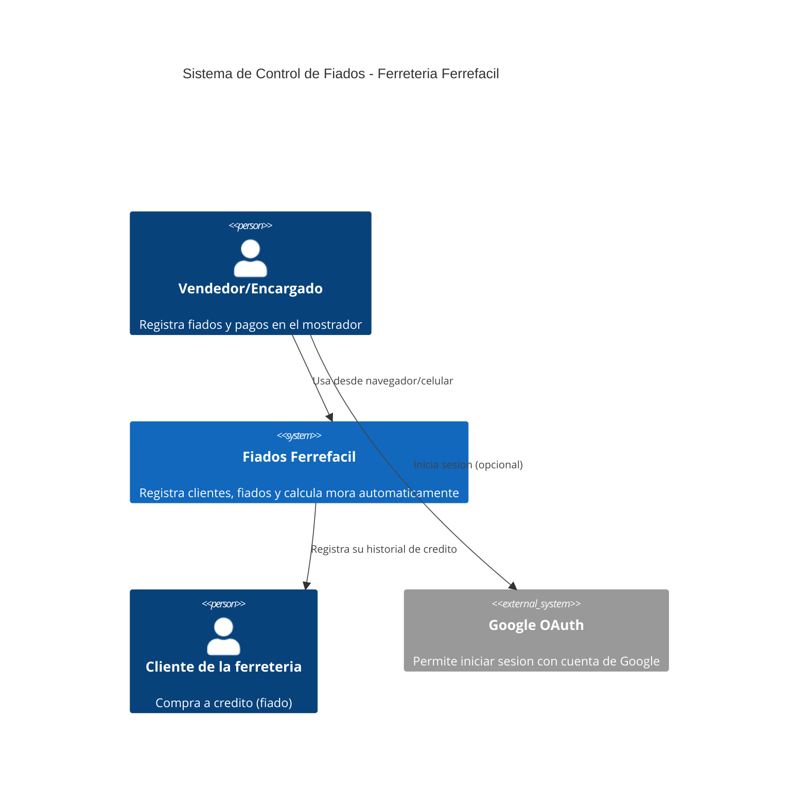
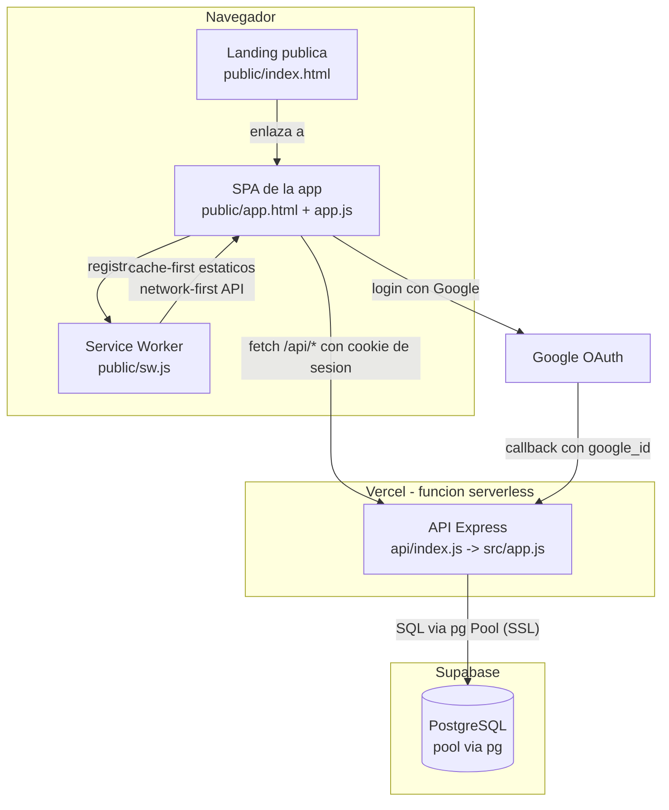

# Arquitectura · Fiados Ferrefacil

## Contexto (C4 - Nivel 1)

## Contenedores (C4 - Nivel 2)

## Decisiones clave

- **Funcion serverless en Vercel**: la API Express corre como funcion serverless (`api/index.js`), con despliegue automatico por Pull Request. Ver ADR-003.
- **PostgreSQL gestionado en Supabase** en vez de SQLite embebido (ver ADR-001, superado por ADR-003): necesario porque Vercel no ofrece disco persistente entre invocaciones.
- **Autenticacion por sesion en cookie httpOnly** (ver ADR-002), con dos formas de iniciar sesion: correo/contrasena, o Google OAuth. Ambas terminan creando una fila en la tabla `sesiones`, así que la logica de revocacion es la misma sin importar como se autentico el usuario.
- **Service Worker con dos estrategias**: cache-first para los archivos estaticos (para que la app cargue offline) y network-first para `/api/*` (los datos de fiados deben ser siempre actuales, nunca mostrar saldos obsoletos sin avisar).

## Lo que funciona sin internet y lo que no

- **Funciona offline**: la interfaz carga (HTML/CSS/JS cacheados por el service worker), y el usuario ve la ultima pantalla que tenia abierta.
- **No funciona offline**: crear clientes, registrar fiados o pagos, ni iniciar sesion (por correo o por Google), porque todo eso requiere conexion a la API en Vercel y de ahi a Supabase. Se decidio no usar una cola de sincronizacion offline (background sync) porque el dinero real no puede quedar en un estado "a confirmar" sin que el vendedor lo sepa.