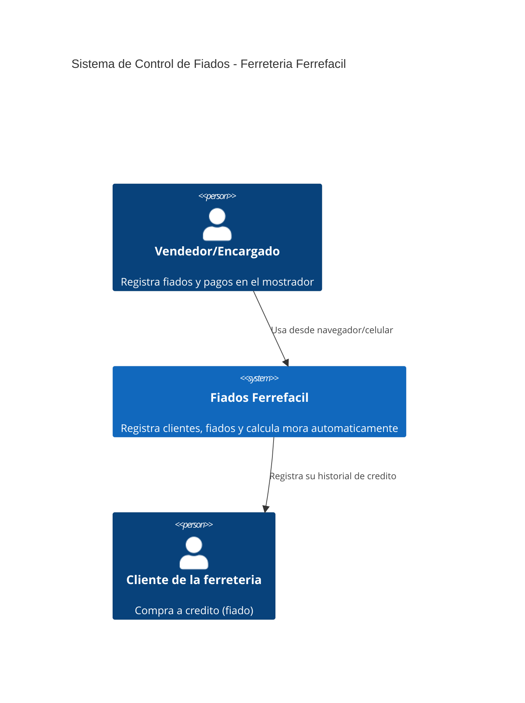
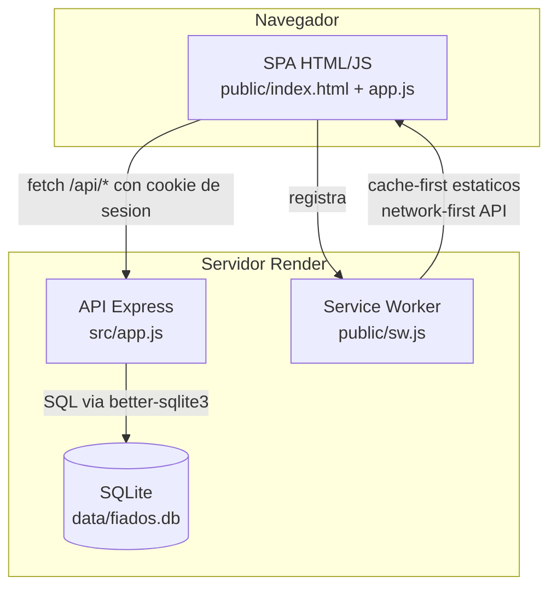

# Arquitectura · Fiados Ferrefacil

## Contexto (C4 - Nivel 1)

## Contenedores (C4 - Nivel 2)

## Decisiones clave

- **Monolito simple**: un solo servicio Express sirve la API y el frontend estatico. Reduce piezas moviles, ideal para desplegar en Render con disco persistente.
- **SQLite embebido** en vez de Postgres gestionado (ver ADR-001): suficiente para el volumen real de una ferreteria pequena y evita depender de un proveedor externo de base de datos.
- **Autenticacion por sesion en cookie httpOnly** (ver ADR-002) en vez de JWT: mas simple de razonar e invalidar (basta con borrar la fila en `sesiones`).
- **Service Worker con dos estrategias**: cache-first para los archivos estaticos (para que la app cargue offline) y network-first para `/api/*` (los datos de fiados deben ser siempre actuales, nunca mostrar saldos obsoletos sin avisar).

## Lo que funciona sin internet y lo que no

- **Funciona offline**: la interfaz carga (HTML/CSS/JS cacheados por el service worker), y el usuario ve la ultima pantalla que tenia abierta.
- **No funciona offline**: crear clientes, registrar fiados o pagos, porque requieren escribir en la base de datos del servidor. Se decidio no usar una cola de sincronizacion offline (background sync) porque el dinero real no puede quedar en un estado "a confirmar" sin que el vendedor lo sepa — el riesgo de doble cobro o fiados duplicados es mayor que la inconveniencia de pedir conexion para escribir.
